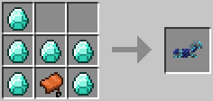
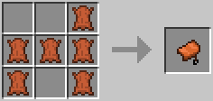
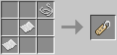

# QoLPlugin
My Quality of Life Spigot Minecraft Plugin

------

* Close Inventory by clicking outside
* Rotate redstone comparators and repeaters with sneak + right click
* Break trees faster (Timber)  
  (all changes can be disabled in the config.yml file)
* Grow vines with bone meal or vines
---
* bread and book crafts are now shapeless (no need for a crafting table anymore)
* Custom furnace recipes
  * rotten flesh -> leather
---
* Custom crafting recipes
  * 4 stairs -> 6 blocks
  * 2 slabs -> block
  * 4 flint -> gravel
  * 1 wool -> 4 string
  * dropper + bow -> dispenser
  * horse armor  
      
    (all crafting patterns are customisable with the config.yml file)
  * saddle  
    
  * nametag  
    

------

### TODO

* edit signs with sneak + right click
* edit armorstand pose with sneak + right click